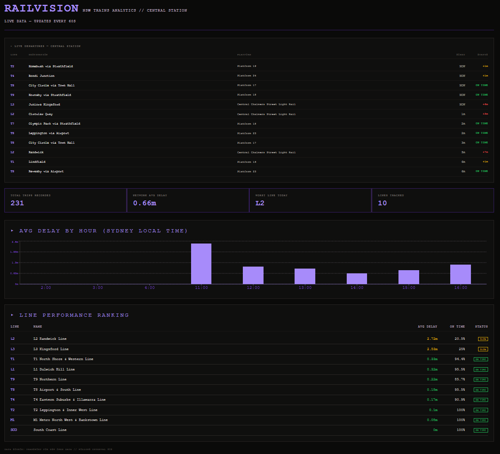
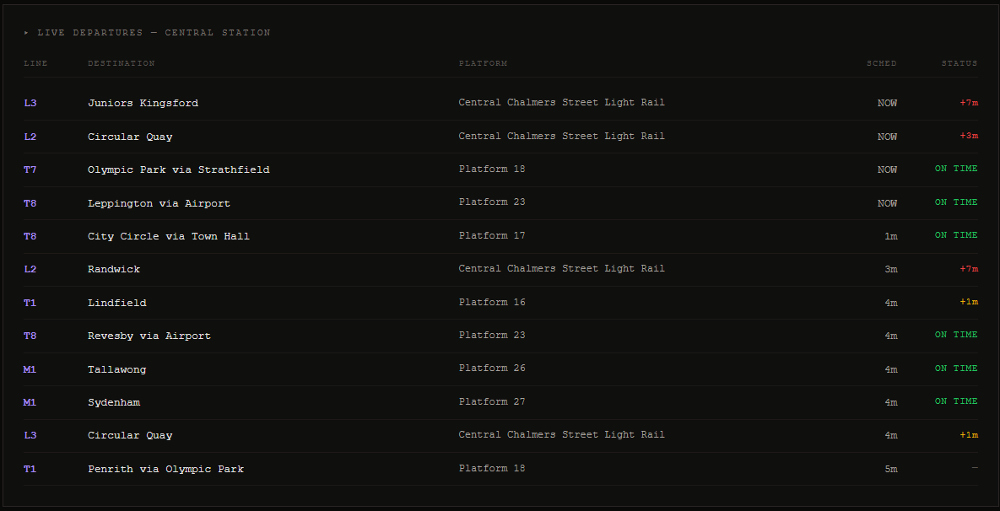
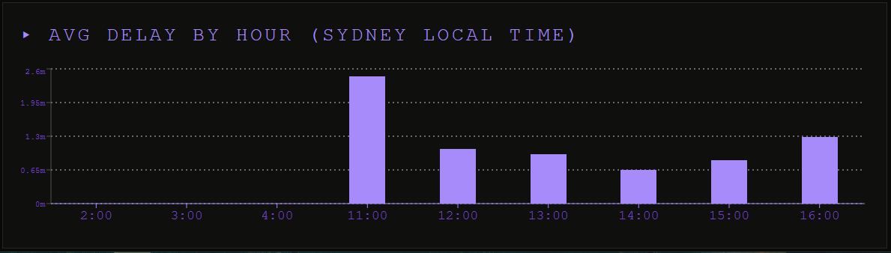

# RailVision

**Live NSW Trains analytics dashboard — real-time departure tracking and delay analysis for Central Station, Sydney.**

🔗 **[Live Demo](https://railvision-frontend.vercel.app)** &nbsp;|&nbsp; 📡 **[API Docs](https://railvision-backend.onrender.com/docs)**

---



---

## What it does

RailVision pulls live departure data from the Transport for NSW (TfNSW) Open Data API every 60 seconds, stores it in a PostgreSQL database and presents real-time analytics on train performance across Sydney's rail network. Users can see upcoming departures from Central Station with live delay status, track which lines are consistently delayed and explore delay patterns by hour of day.

---

## Features

- **Live departure board** — next trains from Central Station with platform, destination, scheduled time, and real-time delay status
- **Line performance rankings** — all T, L, and M lines ranked by average delay with on-time percentage
- **Delay by hour chart** — bar chart showing which hours of the day have the worst delays (Sydney local time)
- **Network stats** — total trips recorded, network average delay, worst performing line
- **Auto-refresh** — dashboard updates every 60 seconds without page reload
- **Background poller** — server continuously collects data every 60 seconds using APScheduler

---

## Screenshots

### Dashboard Overview
<!-- (FULL DASHBOARD SCREENSHOT HERE) -->


### Live Departure Board
<!-- (DEPARTURE BOARD SCREENSHOT HERE) -->


### Delay Analytics
<!-- (ANALYTICS/CHART SCREENSHOT HERE) -->


---

## Tech Stack

| Layer | Technology |
|---|---|
| Backend | Python, FastAPI |
| Database | PostgreSQL (Supabase), SQLite (local dev) |
| ORM | SQLAlchemy |
| Data processing | Pandas |
| Scheduling | APScheduler |
| Frontend | React, Vite, Recharts |
| Deployment | Render (backend), Vercel (frontend) |
| Data source | Transport for NSW Open Data API |

---

## Architecture

```
TfNSW Open Data API
        │
        ▼
  APScheduler (every 60s)
        │
        ▼
  FastAPI Backend (Render)
    ├── GET /departures/live/{stop_id}   → live API call, filtered to trains
    ├── GET /analytics/worst-lines       → DB query, grouped by line
    ├── GET /analytics/delays/by-hour    → DB query, grouped by hour (AEDT)
    └── POST to PostgreSQL (Supabase)
              │
              ▼
        PostgreSQL DB
        (unique constraint on line + scheduled time + stop)
              │
              ▼
    React Frontend (Vercel)
    ├── Live departure board
    ├── Line performance table
    ├── Delay by hour bar chart
    └── Tracking statistics chart
```

---

## Key Engineering Decisions

**SQLite locally, PostgreSQL in production** — SQLAlchemy's ORM abstracts the DB layer so the same models and queries work in both environments with just a connection string swap. This keeps local development fast with zero setup while using a production-grade DB on Render.

**Unique constraint + upsert instead of naive inserts** — rather than inserting 40 rows every 60 seconds, each departure is uniquely identified by `(line, scheduled_time, stop_id)`. On conflict, the row is updated with the latest estimated time and delay. This keeps the dataset clean and the trip count meaningful.

**Composite indexes on frequently queried columns** — added `(line, scheduled)` and `(stop_id, scheduled)` indexes to speed up analytics queries that filter and group on these columns.

**UTC storage, AEDT display** — all timestamps are stored in UTC in the DB. The by-hour analytics query applies an `+11 hours` interval offset in Postgres before extracting the hour and the frontend calculates relative departure times from UTC directly.

**Background poller over cron** — APScheduler runs inside the FastAPI process so no separate infrastructure is needed. UptimeRobot pings the server every 5 minutes to prevent Render's free tier from spinning down.

---

## Running locally

### Prerequisites
- Python 3.12+
- Node.js 20+
- A [TfNSW Open Data](https://opendata.transport.nsw.gov.au/) API key

### Backend
```bash
cd backend
pip install -r requirements.txt

# create .env in project root
echo "TFNSW_API_KEY=your_api_key_here" > ../.env

uvicorn main:app --reload
```

### Frontend
```bash
cd frontend
npm install
npm run dev
```

Then open `http://localhost:5173`. The frontend will use your local backend at `http://localhost:8000` (update the `API` constant in `App.jsx` if needed).

---

## Future improvements

- **Multi-station support** — extend polling to other major stations (Town Hall, Wynyard, Parramatta) with a station selector in the UI
- **WebSockets** — replace polling with a persistent connection for true real-time updates
- **Historical trend analysis** — week-on-week delay comparisons, worst days of the week
- **Alerting** — notify users when a specific line is running significantly behind
- **Mobile responsive UI** — optimise the dashboard layout for smaller screens

---

## Data source

Data is sourced from the [Transport for NSW Open Data API](https://opendata.transport.nsw.gov.au/) under the Transport for NSW open data licence.
