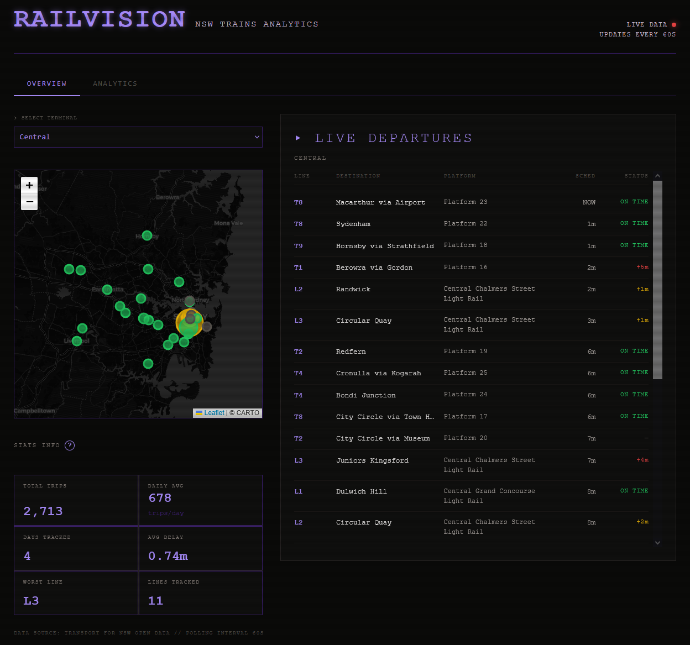
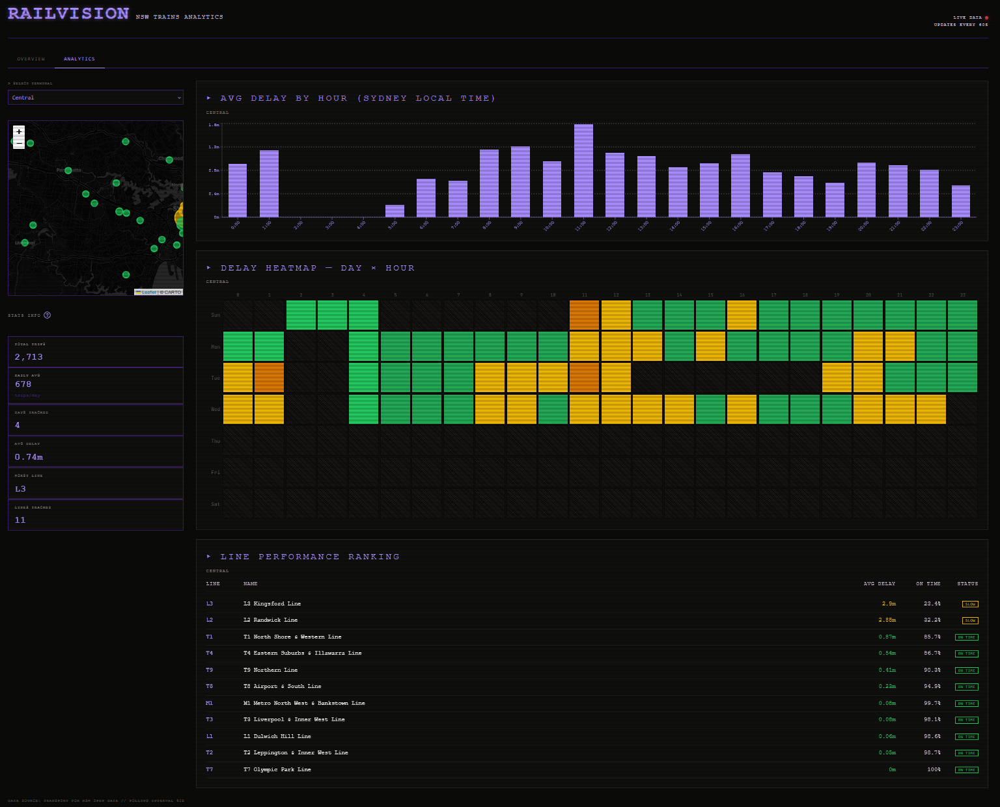
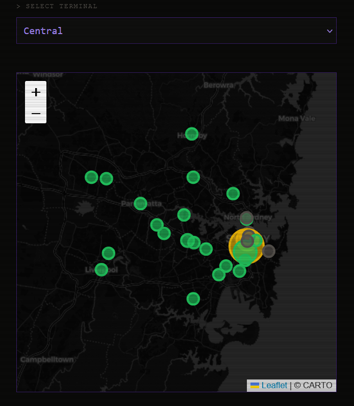
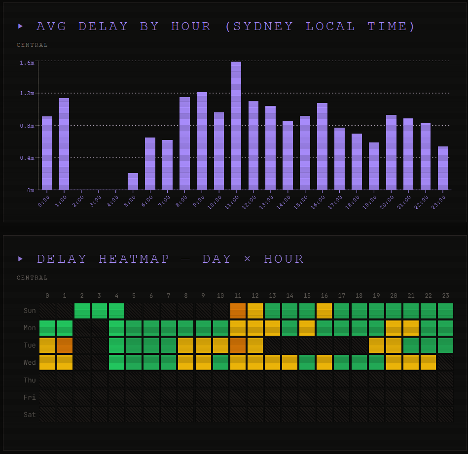
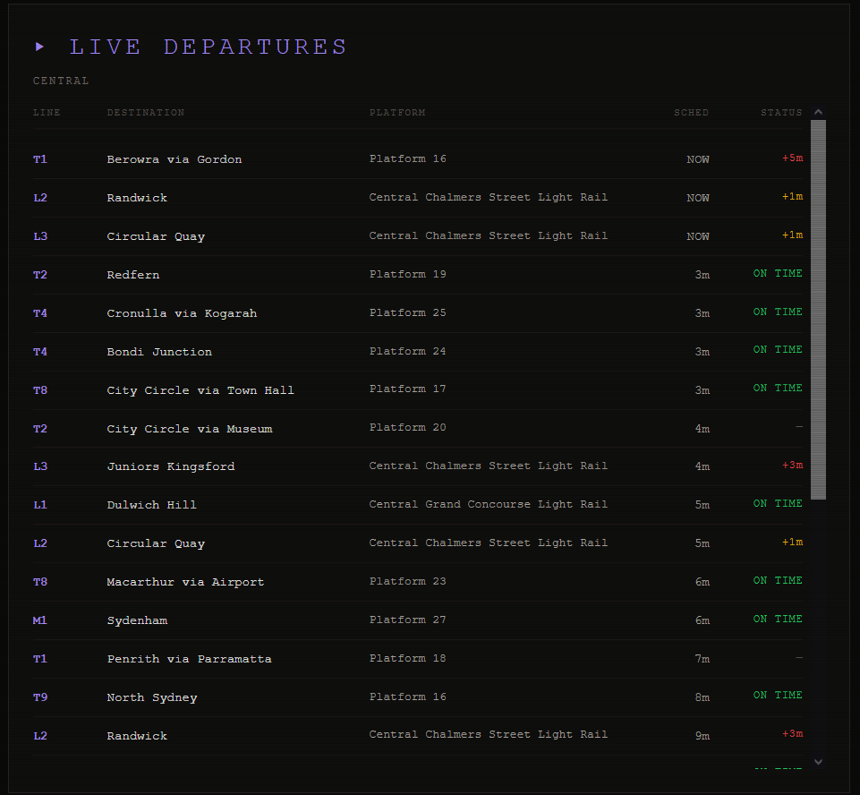

# RailVision

**Live NSW Trains analytics dashboard: real-time departure tracking and delay analysis for major train stations across Sydney's rail network.**

🔗 **[Live Demo](https://railvision-frontend.vercel.app)** (currently down due to free tier) &nbsp;|&nbsp; 📡 **[API Docs](https://railvision-backend.onrender.com/docs)**

---



---

## What it does

RailVision pulls live departure data from the Transport for NSW (TfNSW) Open Data API every 60 seconds, stores it in a PostgreSQL database and presents real-time analytics on train performance across Sydney's rail network. Users can see upcoming departures from major stations within the Sydney Trains network with live delay status and track which lines are consistently delayed and explore delay patterns by hour and day through historical data collection.

---

## Features

- **Live departure board** - upcoming trains for all 32 stations with platform, destination, scheduled time, and real-time delay status
- **Multi-station support** - through interactive map as primary navigation tool with click-to-select, alongside traditional dropdown/search tool
- **Line performance rankings** - all T, L, and M lines ranked by average delay with on-time percentage
- **Delay across week** - Day/hour heatmap showing peak disruption windows
- **Delay by hour chart** - bar chart showing which hours of the day have the worst delays (Sydney local time)
- **Network stats per station** - total trips recorded, average trips per day, duration of RailVision tracking, average delay, worst performing line, total lines tracked
- **Background poller** - server continuously collects data every 60 seconds using APScheduler with dashboard auto-refresh

---
## Screenshots

### Dashboard Overview


### Interactive Station Map


### Delay Heatmap


### Live Departure Board


---

## Tech Stack

| Layer | Technology |
|-------|-----------|
| Backend | Python, FastAPI |
| Database | PostgreSQL (Supabase), SQLite (local dev) |
| ORM | SQLAlchemy |
| Data processing | Pandas |
| Scheduling | APScheduler |
| Frontend | React, Vite, Recharts, Leaflet |
| Deployment | Render (backend), Vercel (frontend) |
| Data source | Transport for NSW Open Data API |

---

## Architecture

```
TfNSW Open Data API
        │
        ▼
  APScheduler (every 60s)
  polls 32 stations concurrently
        │
        ▼
  FastAPI Backend (Render)
    ├── GET /departures/live/{stop_id}         → live API call, filtered to trains
    ├── GET /analytics/worst-lines             → DB query, grouped by line
    ├── GET /analytics/delays/by-hour          → DB query, grouped by hour (AEDT)
    ├── GET /analytics/delays/by-day-hour      → DB query, day × hour heatmap
    ├── GET /analytics/stations/summary        → per-station avg delay + worst line
    └── POST to PostgreSQL (Supabase)
              │
              ▼
        PostgreSQL DB
        (unique constraint on line + scheduled time + stop_id)
              │
              ▼
    React Frontend (Vercel)
    ├── Interactive Leaflet map (32 stations, click to select)
    ├── Live departure board (updates per selected station)
    ├── Line performance ranking table
    ├── Delay by hour bar chart
    ├── Day × hour delay heatmap
    └── Network statistics cards
```

---

## Key Engineering Decisions

**SQLite locally, PostgreSQL in production** - SQLAlchemy's ORM abstracts the DB layer so the same models and queries work in both environments with just a connection string swap. This keeps local development fast with zero setup while using a production-grade DB on Render.

**Unique constraint + upsert instead of naive inserts** - rather than inserting 40 rows every 60 seconds, each departure is uniquely identified by `(line, scheduled_time, stop_id)`. On conflict, the row is updated with the latest estimated time and delay. This keeps the dataset clean and the trip count meaningful.

**Composite indexes on frequently queried columns** - added `(line, scheduled)` and `(stop_id, scheduled)` indexes to speed up analytics queries that filter and group on these columns.

**UTC storage, AEDT display** - all timestamps are stored in UTC in the DB. The by-hour analytics query applies a `+11 hours` interval offset in Postgres before extracting the hour, and the frontend calculates relative departure times from UTC directly.

**Background poller over cron** - APScheduler runs inside the FastAPI process so no separate infrastructure is needed. UptimeRobot pings the server every 5 minutes to prevent Render's free tier from spinning down.

**Map as primary navigation instead of a dropdown** - rather than a standard select input, the interactive Leaflet map serves as the station selector. Clicking a station marker updates all analytics views for that station. This makes the spatial relationship between stations part of the UX so users can see which stations are close together and how their delay profiles compare geographically.

**Line allowlist filter over prefix matching** - train lines are filtered using a regex (`^[TLMS][0-9]$`) rather than simple prefix matching. This excludes bus routes like T80 or M10 that share prefixes with train lines, keeping analytics clean and limited to actual rail services.

---

## Running Locally

### Prerequisites
- Python 3.12+
- Node.js 20+
- A [TfNSW Open Data](https://opendata.transport.nsw.gov.au/) API key

### Backend

```bash
cd backend
pip install -r requirements.txt

# create .env in backend directory
echo "TFNSW_API_KEY=your_api_key_here" > .env

uvicorn main:app --reload
```

### Frontend

```bash
cd frontend
npm install
npm run dev
```

Then open `http://localhost:5173`. The frontend will use your local backend at `http://localhost:8000` (update the `API` constant in `App.jsx` if needed).

---

## Future Improvements

- **WebSockets** - replace polling with a persistent connection for true real-time updates
- **Week-on-week comparisons** - track whether delays are getting better or worse over time
- **Alerting** - notify users when a specific line is running significantly behind
- **Filters** - additional filters to see historical data for past day, week etc.
- **Mobile responsive UI** - optimise the dashboard layout for smaller screens
- **Status history** - track delay trends per station over rolling 7 and 30 day windows

---

## Data source

Data is sourced from the [Transport for NSW Open Data API](https://opendata.transport.nsw.gov.au/) under the Transport for NSW open data licence.
